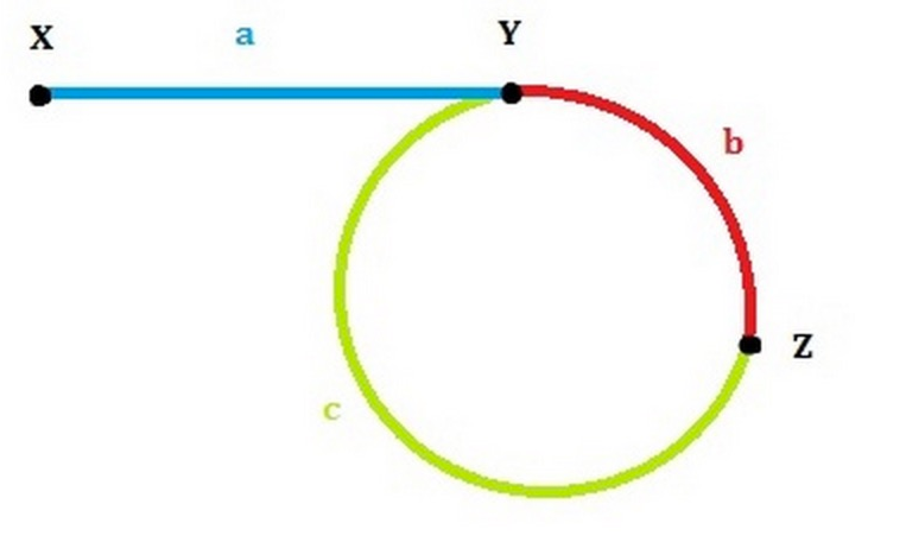

# Cycle

[ **141. Linked List Cycle**](https://leetcode.com/problems/linked-list-cycle/description/)

Given a linked list, determine if it has a cycle in it.

Follow up:  
Can you solve it without using extra space?

**My Solutions**:

用快慢node，只要fast != null && fast.next != null，fast跳两步，slow跳一步，如果两者相同，说明有环，否则无环

```text
public class Solution {
    public boolean hasCycle(ListNode head) {
        ListNode slow = head, fast = head;
        while (fast != null && fast.next != null) {
            
            fast = fast.next.next;
            slow = slow.next;
            if (fast == slow) return true;
        }
        return false;
    }
}
```

[ **142. Linked List Cycle II**](https://leetcode.com/problems/linked-list-cycle-ii/description/)

Given a linked list, return the node where the cycle begins. If there is no cycle, return `null`.

**Note:** Do not modify the linked list.

**Follow up**:  
Can you solve it without using extra space?

**My Solutions**:

Question: 找到cycle开始的node。

* 同样用快慢node，只要fast != null && fast.next != null，fast跳两步，slow跳一步。当两者相同时，说明有环。
* 假设fast,slow相遇于Z，fast走过\(a + b + c + b\), slow走过\(a + b\), fast走过slow的两倍距离：2 \* \(a + b\) = a + b + c + b  ==&gt; 2a + 2b = a + c + 2b ==&gt; a = c
* 此时另一个third node 从X开始跳，每次一步。slow从Z开始，也每次一步。当third和slow相同时，return third.
* Time: O\(n\); Space: O\(1\)




```text
public class Solution {
    public ListNode detectCycle(ListNode head) {
        ListNode fast = head, slow = head;
        while (fast != null && fast.next != null) {
            fast = fast.next.next;
            slow = slow.next;
            if (fast == slow) {
                ListNode third = head;
                while (third != slow) {
                    third = third.next;
                    slow = slow.next;
                }
                return third;
            }
        }
        return null;
    }
}
```

