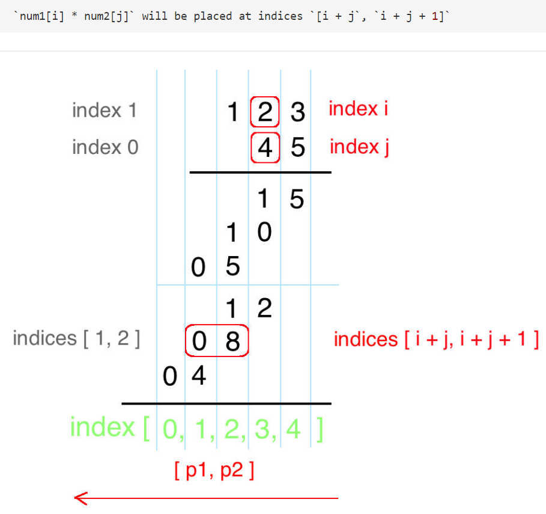

# 43. Multiply Strings

[** 43. Multiply Strings**](https://leetcode.com/problems/multiply-strings/description/)

Given two non-negative integers `num1` and `num2` represented as strings, return the product of `num1` and `num2`, also represented as a string.

**Example 1:**

```text
Input: num1 = "2", num2 = "3"
Output: "6"
```

**Example 2:**

```text
Input: num1 = "123", num2 = "456"
Output: "56088"
```

**Note:**

1. The length of both `num1` and `num2` is &lt; 110.
2. Both `num1` and `num2` contain only digits `0-9`.
3. Both `num1` and `num2` do not contain any leading zero, except the number 0 itself.
4. You **must not use any built-in BigInteger library** or **convert the inputs to integer** directly.

**My Solutions:**




```text
class Solution {
    public String multiply(String num1, String num2) {
        if (num1 == null || num2 == null || num1.length() == 0 || num2.length() == 0) return "0";
        
        int[] res = new int[num1.length() + num2.length()];
        
        for (int i = num1.length() - 1; i >= 0; i--) {

            for (int j = num2.length() - 1; j >= 0; j--) {
                int product = (num1.charAt(i) - '0') * (num2.charAt(j) - '0');
                int p1 = i + j, p2 = p1 + 1;
                
                int sum = res[p2] + product; //sum需要加上之前当下位置的数
                res[p1] += sum / 10; //p1是左边的位置
                res[p2] = sum % 10; //p2是当下位置
            } 
        }
        
        StringBuilder sb = new StringBuilder();
        for (int i : res) {
            if (!(i == 0 && sb.length() == 0)) { //[0, 0, 1, 0, 3] 跳过leading zero
                sb.append(i);
            }
        }
        return sb.length() == 0 ? "0" : sb.toString();
    }
}
```

 Time: O\(n \* m\); Space: \(n + m\)

